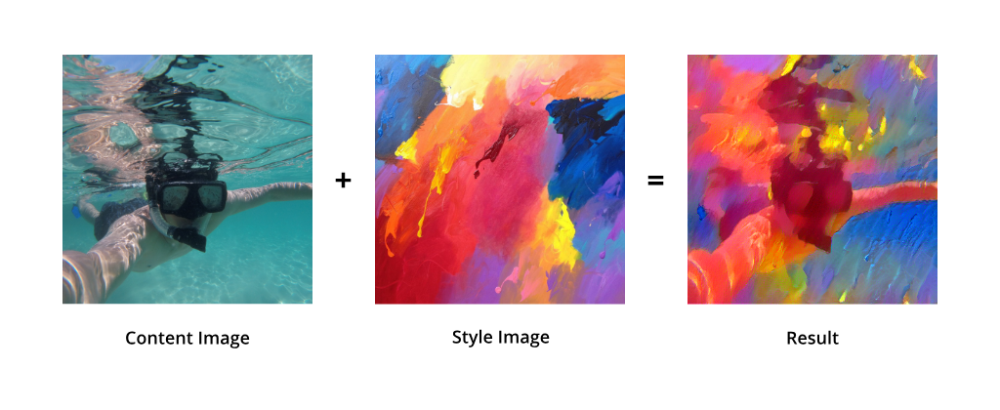
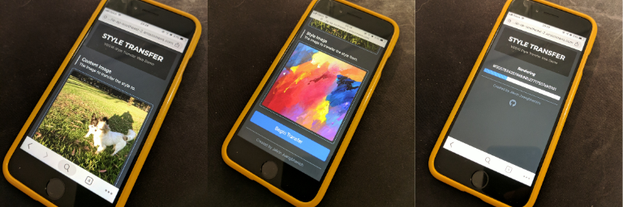
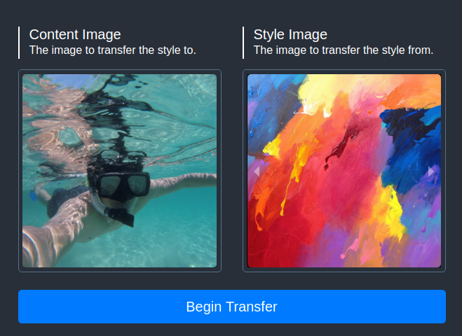
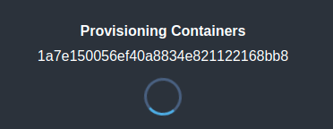
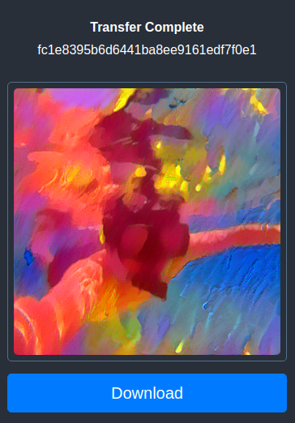
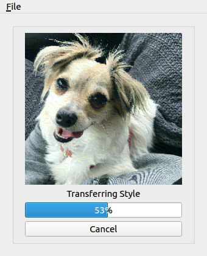
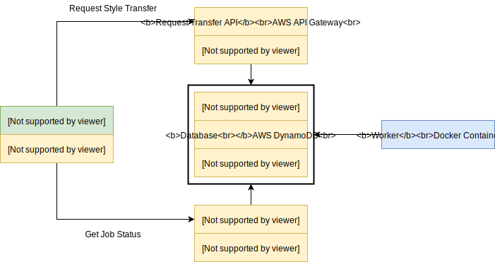

# **Pytorch** Style Transfer: Web App
[](https://travis-ci.com/krinj/pytorch-style-transfer) [](https://cloud.docker.com/u/infrarift/repository/docker/infrarift/style-transfer-worker) [](http://krinj-style-transfer.s3-website-ap-southeast-2.amazonaws.com/)

This is an implementation of a [Style Transfer Network](https://medium.com/tensorflow/neural-style-transfer-creating-art-with-deep-learning-using-tf-keras-and-eager-execution-7d541ac31398) from [Udacity's Deep Learning Nanodegree](https://www.udacity.com/course/deep-learning-nanodegree--nd101), wrapped in a CLI interface, a desktop interface, and a hosted web app (cloud) interface. The purpose of this project is to explore ways of deploying an image based inference model end-to-end. The project is built using Python, Pytorch, Docker, React, and AWS.

## Contents

* [Overview](#overview)
* [Usage](#usage)
* [Deployment](#deployment)
* [Architecture](#architecture)
* [Tech Stack](#tech-stack)
* [To Do](#to-do)

## Overview

**Style Transfer** is a technique we can use to render one image (the content image) in the style of another (the style image). For example, maybe I want to make a photo look like it was painted with watercolor. This is similar to the technology behind apps like [Prisma](https://prisma-ai.com/).



I first learnt about the ins-and-outs of style transfer whilst participating in the *fantastic* [Udacity Deep Learning Nanodegree](https://www.udacity.com/course/deep-learning-nanodegree--nd101). The module guided me through implementing a very basic (and intuitive) style transfer network (which is the one you'll find in this project).

#### Network Details

At a high level, this implementation uses a **VGG19** Neural Network, pretrained on ImageNet. Its classification head has been removed - we are just using it for feature extraction. The input are two images, the **content image** and the **style image**. We can clone the content image into our new target image, which we will try to 'optimize' into a new image.

The overall loss function is calculated by combining a content loss and a style loss. These are calculated by comparing the distance between the features of the target image (gained by forwarding it through the network) and content/style images. The pixel values of the target image is then optimized against this loss to slowly transform the image.

> **Note**: Because this is actually an optimization model rather than an inference model, it is incredibly slow. It can take 15 minutes for this network to produce a good result, even on GPU. Whereas something like Prisma can produce results within seconds.

#### Project Motivation

Style transfer is fun! But alas, this project isn't *really* about style transfer. This is about software infrastructure; building an end-to-end pipeline around a neural network. It's nice to have all this code wrapped up in a Jupyter Notebook for playing around with, but what if we wanted to make this usable? For example, into a product, or a tool, or a service? Maybe even access it from the browser or on the phone?

My goal with this project is to try and turn this model into a service. I wanted to learn what this would involve, and maybe pick up some useful skills along the way. I also wanted to create this as a sort of 'boilerplate,' so I could reference it if I needed to do something similar in the future.

#### Project Features

* **Responsive Web Front End**: Upload content images and select from a gallery of style images to execute a transfer operation. The front end can also be used on mobile.
* **Supporting Back End**: A message queue, database, and lambda functions support the operation of the service.
* **Dockerized Neural Net**: The model and style transfer code are all contained in a Docker container so that it can be deployed anywhere for inference. The app polls the database for new jobs.
* **Travis CICD**: Any push to the `master` branch on GitHub will cause Travis CI to build and deploy both the static site and the Docker container.
* **(Bonus) Desktop App and CLI**: I also included some scripts that show how to use the network both as a desktop app (PyQT) or directly via CLI.





## Usage

#### Web App

[Click here](http://krinj-style-transfer.s3-website-ap-southeast-2.amazonaws.com/) to see the currently deployed static site.

> **Note**: I'm probably not going to leave my GPU worker running 24/7, so the inference process is likely to be stuck in the 'provisioning' state if you use the web app. To get the full functionality, you might need to build and host it yourself.

Once you open the web app landing page, you should see two boxes. In one of them, you can select an image from your computer (or mobile) to upload. In the other box, you can click to choose from a couple of different style images. Press **Begin Transfer** to start the magic.




The 'job' will be given a unique ID. To access the job's status (whether it is in progress or has been completed), you can go to the route:

```
/display?id=<JOB_ID>
```

You'll be automatically taken to a page that tracks the progress of that job. At the beginning, it will need to provision the resources to do the transfer. If no GPU worker is available to do the job, it will just be stuck in this state indefinitely.



Once the container starts to process the job, the progress will be reported on the page. On a **GeForce 1060**, it takes around 20 minutes to process a job.


Once the process is complete, the page will update with the resulting image, and a button to download it. **That's it! Job done!**




#### Desktop App

To run the desktop app, you need to install the requirements and run the command.

```bash
cd app
pip install -r requirements
python cmd_open_editor.py
```

You should see a native window appear with options to select a style and a content image.


Click **Start** to begin the transfer. 

> **Note**: I haven't really implemented any settings options yet. That's gonna be a #TODO for me :)



#### CLI

Finally, you can also run the app as a command. Just pass in a path to the content image and the style image as parameters.

```bash
# Run the transfer for 3000 epochs. Don't forget to replace the paths!
python cmd_run_style_transfer.py -c <CONTENT_IMAGE_PATH> -s <STYLE_IMAGE_PATH> -e 3000
```

## Deployment

#### Front End

The front end is a static site hosted on S3 (but you can host it anywhere). It is built from `create-react-app`. The app itself is quite simple and can be found in the `/site` directory of this project. Just [deploy](https://facebook.github.io/create-react-app/docs/deployment) this like any other React site, e.g. using `npm build`. Here are some of the resources I used to learn React:

* [Getting started with React](https://reactjs.org/docs/hello-world.html)
* [Deploying a React App to S3](https://medium.com/ovrsea/deploy-automatically-a-react-app-on-amazon-s3-iam-within-minutes-da6cb0096d55)
* [Udemy: React 16.6](https://www.udemy.com/react-the-complete-guide-incl-redux/)

#### Back End

The back-end is built entirely using AWS. There are more details for how the architecture works as a whole below, but here are some rough steps:

1. [Create an S3 bucket](https://docs.aws.amazon.com/AmazonS3/latest/gsg/CreatingABucket.html) to store the transfer image data. The bucket should have public read permissions. The bucket should have directories `source`, `style` and `output`.
2. [Create two lambda functions](https://docs.aws.amazon.com/lambda/latest/dg/getting-started-create-function.html). These will be Python 3.6 functions, and will contain the API logic that is used by the React front end. The scripts for each function can be found in the `/lambda_functions` directory.
3. [Create API endpoints](https://docs.aws.amazon.com/apigateway/latest/developerguide/integrating-api-with-aws-services-lambda.html) for the functions. Update the front end with these endpoints as well (right now they are hard-coded with the ones I've created).
4. [Create an SQS message queue](https://aws.amazon.com/sqs/). Remember that we'll need the id of the queue to be updated in the lambda functions and the docker container as well.
5. [Create a DynamoDB table](https://docs.aws.amazon.com/amazondynamodb/latest/developerguide/SQLtoNoSQL.CreateTable.html) to store the job status and image links. I use `job_id` as the primary key.

Most of the work here is just picking names for the services we are creating, and then updating the rest of the services and the app with the endpoints and names so all the back-end is linked up and ready to go.

#### Docker Container

The actual inference code and model is wrapped up inside a [Docker](https://www.docker.com/) container, so we can run and deploy it anywhere. The container in this repository is automatically built with each push by [TravisCI](https://travis-ci.com/) and can be downloaded from its [DockerHub page](https://cloud.docker.com/u/infrarift/repository/docker/infrarift/style-transfer-worker).

To build the container locally:

```bash
cd app
docker build -t style-transfer-worker .
```

To download the container from Docker Hub:

```bash
docker pull infrarift/style-transfer-worker
```

The container needs to be run with a few different environment variables. Most of these are either access keys or API endpoints. An example file `run_worker.sh` is included for convenience. Just don't forget to change the redacted values, region, and image name accordingly.

```bash
docker run -it \
    -e AWS_ACCESS_KEY_ID=<REDACTED> \
    -e AWS_SECRET_ACCESS_KEY=<REDACTED> \
    -e AWS_DEFAULT_REGION=ap-southeast-2 \
    -e SQS_QUEUE_URL=<REDACTED> \
    -e S3_BUCKET_NAME=<REDACTED> \
    -e DYNAMO_DB_TABLE_NAME=<REDACTED> \
    -e EPOCHS=5000 \
    infrarift/style-transfer-worker
```

In its default command, the container will just loop and poll the message queue (SQS) for any new jobs every minute. When it finds a new job, it will begin to process. It stays in this loop until terminated.

The container must be hosted on any machine that has GPU capability - even if its your own desktop. Cloud options include: [AWS](https://aws.amazon.com/) | [Paperspace](https://www.paperspace.com/) | [Google Cloud](https://cloud.google.com/)

## Architecture

This is a high level diagram of how the entire app is put together. There's a lot of inefficiencies here I'm sure, so please if you know any way to improve the design, send me an email!



##### Front End

The site is built on React. This is the UI that the user interacts with. It is hosted as a static site on AWS S3. The back-end exposes two REST API endpoints, which the front-end site uses. The first is to **request a style transfer**, accepting a content image and a style image as B64 data. The second is to **check the status**, which will return the progress of a job that's currently processing, or a link to the resulting image if it has completed.

##### API

The APIs are implementing using AWS Lambda functions connected to API Gateway. The Lambda function is written in Python 3.6, and its purpose is to process the POST data and populate the message queue and database with the appropriate data.

**Request Transfer API**

This API expects both the content image and the style image as Base 64 encoded strings. It will turn these back into a file and upload it to S3. It will then populate the DynamoDB with a job ID, and the link to these images. The job ID is then added to the message queue (SQS) so that a worker can read and process it.

**Check Status API**

This just queries the DynamoDB with the specified job ID to check its progress (or result image link, if the job is completed).

**Worker (Docker Container)**

The Docker container must be hosted on a GPU machine. It contains the inference code, and an app which polls the message queue for new jobs. When a new message is found, it will delete it from the queue and begin processing it.

### Tech Stack

Here is a list of the major technologies I've used in this project, what they are, and why I chose to use them.

| Name        | Role                     | Reason                                                       |
| ----------- | ------------------------ | ------------------------------------------------------------ |
| React       | Javascript UI framework. | It's relatively simple to learn, and it's a great way to build a website that feels like an app in terms of UI and responsiveness. |
| S3          | File storage service.    | Just a simple way to host all the files needed for the service. It hosts the React app as a static site, and also the images we'll process. |
| Lambda      | Serverless compute.      | I use this to host some simple Python scripts which glue the front-end and back-end pieces together. The scripts will upload files to S3, modify the rows in the database, and post a JSON message to the message queue. I like serverless because I only need small scripts to run only when I need them. Getting a persistent server just for these scripts is a bit overkill, so Lambda is perfect (you only get billed per millisecond of compute usage). |
| API Gateway | API Enpoint.             | To use the serverless functions, I need a way to call them from the front end. API Gateway simply hooks each Lambda function up with a public REST API endpoint. I can then send a POST/GET requests to these endpoints from the React site. |
| DynamoDB    | Database.                | I needed a simple database to store the job IDs, the progress status, and links to the image files. Having this, I can simply query the database to find out the status of a job, or to get its results. SQL is overkill, but any other simple database would have been fine. |
| SQS         | Message Queue.           | This is not an essential service, maybe there is a way to make this work without an MQ. But I thought it would be good practice to implement one. New jobs are basically created as a message in the queue (a JSON object) by the Lambda function. A worker will then poll the queue for new messages, and process any outstanding jobs. |
| Docker      | Container.               | Neural networks and inference code can often come with a lot of messy dependencies. Jamming it all into a Docker image makes it easy to run anywhere without having to worry about dependencies. The worker is built into a Docker image, and can be run either locally or on the cloud. |
| TravisCI    | CICD.                    | Deployment is a pain. Imagine if I had to manually build and deploy the React site every time I made a change! Instead, I can just configure Travis with some instructions, so that every time I push a new commit to this repository, Travis will build and deploy both the React site and the Docker container for me automatically. |

## To Do

There's always room to improve. Here is the list of what I'd do next if I were to continue this project.

- [ ] **Research and implement an inference model that is much faster than what we have now**. This one is great for educational purposes, but it is way too slow. I want a style transfer model that can work in seconds - or even on video!
- [ ] **Look into serverless inference**. I already had a shot at this but failed, so I'll have to try again. I basically want a Lambda service, but for GPU enabled Docker containers. Right now I have to run a 24/7 polling GPU container to support the service. Not great.
- [ ] **Improve the queuing and status polling mechanisms**. I'm a bit of a newbie still at solutions architecture. Maybe I should ask someone with more experience on how to improve the design - for example, how should I poll and report the progress of a job?
- [ ] **Unit and integration tests**. If this 'mini project' was to be complete, we'd also need a test suite for all the components included.